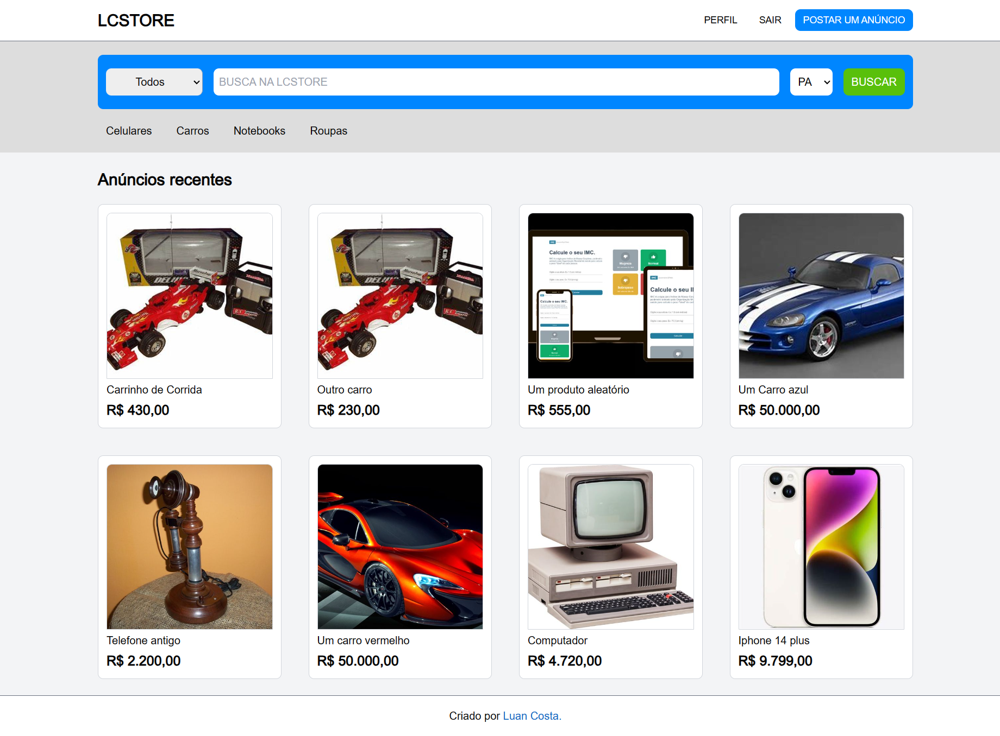

<h1 style="text-align: center;">LCSTORE</h1>
<p>Sell your products and services😃!</p>

## Indice
- [preview](#😁-preview)
- [about](#📃-about)
- [tools](#🔨-tools)
- [how to contribute](#♻️-how-to-contribute)

## 😁 Preview


## 📃 About

**LCSTORE** is an ecommerce site created for users to sell their products or buy others. During its development, I had and am having the opportunity to deepen my knowledge in web development (frontend and backend).
Currently, I am focusing on making it more performant on devices with slow 3G.

## 🔨 Tools
- [React](https://legacy.reactjs.org/)
- [Next](https://nextjs.org/)
- [Typescript](https://www.typescriptlang.org/)
- [Node](https://nodejs.org/en/docs)
- [Tailwindcss](https://tailwindcss.com/)
- [Zod](https://zod.dev/)

## ♻️ How to contribute

```bash
    # Clone the project
    $ git clone https://github.com/Luan-Costa-2l/lcstore
```

```bash
    # Open the directory
    $ cd lcstore
```

```bash
    # Install the dependecies
    $ npm install
```

```bash
    # Run the project
    $ npm run dev
```
